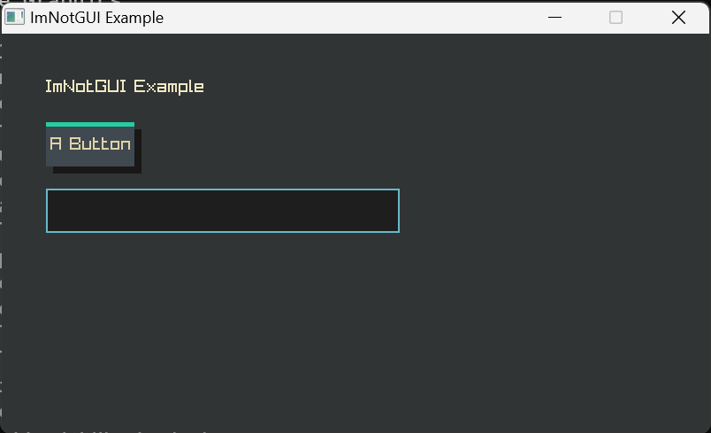

[KOREAN VERSION HERE](README-KOR.md)


# imnotgui-raylib-cpp

imnotgui-raylib-cpp is a ported version of [ZIK's ImNotGUI UI framework](https://github.com/TandyRum1024/sincerly-imnotgui-gml/tree/master) for use with [raylib-cpp](https://github.com/RobLoach/raylib-cpp)

The repository is also influenced by [Omar Cornut's Dear ImGUI](https://github.com/ocornut/imgui)

---

### Features:

* Simple UI - Drawing functions include control logic! The code itself constructs the UI layout.
* Stylish design - Personally, I think ImNotGUI's UI design is really cool.
* Active object recognition - When you click a button and move the cursor outside its range, the button remains pressed. Actually, this feature is already implemented in ImNotGUI.
* Finite state machine - ImNotGUI stores some information in a state machine, similar to OpenGL or GameMaker. This design is adopted to avoid passing too many parameters to the UI functions. Currently, states exist for text alignment position, font type, and font size.

---

### ImNotGUI-raylib-cpp Controls:

There are initially six controls (more will be added!)

* Button
* Tabs
* Slider
* TextBox
* Multiline Textbox
* CheckBox

Additionally, it provides convenient drawing functions! (If you want to use ImNotGUI as the backend, you can implement these functions.)

- iui_label*: Functions for drawing text.

- iui_rect*: Functions for drawing rectangles.

- ~~iui_sprite (with/without atlas): Uses a unique data structure for drawing atlas sprites. That's why it is separately declared in `imnotgui_extra.hpp`.~~

  Forcing a specific atlas structure on library users is bad behavior!

  If you need to draw sprites, please see [rTexLoader](https://github.com/Gabriel-Dropout/rTexLoader) :)

---

### How to Build:

Now CMake is supported! It automatically handles the dependency libraries (raylib/raylib-cpp) :)

The following example is written based on Makefiles.

1. Create a build folder in your project and build from there. The example will be built in the `example` folder.

   **macOS & Linux**

   ```bash
   $ mkdir build && cd build
   $ cmake .. -G "Unix Makefiles"
   $ make
   ```

   **Windows**

   ```powershell
   > mkdir build && cd build
   > cmake .. -G "MinGW Makefiles"
   > mingw32-make
   ```

2. Verify that `example/*.exe` runs correctly.

3. Place `build/src/libimnotgui.a`, `include/imnotgui.hpp`, and `include/imnotgui_extra.hpp` in your project.

4. Happy coding!


---

Example:

```cpp
#include <string>

#include "raylib-cpp.hpp"
#include "imnotgui.hpp"
#include "imnotgui_extra.hpp"


int main() {
    int screenWidth = 800;
    int screenHeight = 450;
    std::string TextboxStr;
    imnotgui::iuiButtonShadow = true;

    raylib::Window w(screenWidth, screenHeight, "ImNotGUI Example");

    SetTargetFPS(60);
    
    while (!w.ShouldClose())
    {
        BeginDrawing();
        imnotgui::iui_begin();
        ClearBackground(imnotgui::iuDark);
        imnotgui::draw::iui_label(50, 50, "ImNotGUI Example", imnotgui::iuCream);
        imnotgui::element::iui_button(50, 100, 100, 50, "A Button");
        imnotgui::element::iui_textbox(50, 175, 400, 50, TextboxStr, "A Textbox");
        imnotgui::iui_end();
        EndDrawing();
    }

    return 0;
}
```




---

### TODO

- [x] Support bitmap fonts.
- [x] Support CMake.
- [x] Remove raylib-cpp dependency.
- [ ] Implement multiline textbox.
- [ ] Support Korean input for TextBox.
- [ ] Write usage documentation.
